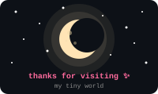

<div align="center">

<!-- Dev Room Banner -->


<br/>

## ⚡ Hey, I'm Nischal

<p>
  I build things, break things, and ship code that works.  
  Competitive programmer · Systems thinker · Problem solver.
</p>

<!-- Pixel Character -->


</div>

---

<div align="center">
  <b>🎮 Stats</b>
</div>

```diff
+ Role      → Student / Developer / Builder  
+ Skills    → C++ | DSA | Systems | Clean Interfaces  
+ Learning  → Low-level systems + design thinking  
+ Interests → Clean code, pixel aesthetics, algorithms
```

<div align="center">

<a href="https://github.com/Nischal07bot">
  
</a>
<a href="https://github.com/Nischal07bot">
  
</a>

<br/>


</div>

---

<div align="center">
  <b>🔗 Portals</b>
</div>

<p align="center">

<a href="https://leetcode.com/u/Nischal0703">
  
</a>
&nbsp;
<a href="https://codeforces.com/profile/agentrico09_09">
  
</a>
&nbsp;
<a href="https://github.com/Nischal07bot">
  
</a>

</p>

---

<div align="center">
  <b>🗺️ Navigation</b>
</div>

```
    [ 🏠 Projects ] ---- [ 🧠 DSA ] ---- [ ⚔️ CP Arena ]
           |                  |                 |
       experiments       problem solving     competitive
```

---

<div align="center">

<!-- Fireplace -->


</div>

<p align="center">
  <code>consistency > motivation</code>
</p>

---

<div align="center">

<!-- Footer -->


</div>

---

<p align="center">
  
</p>
